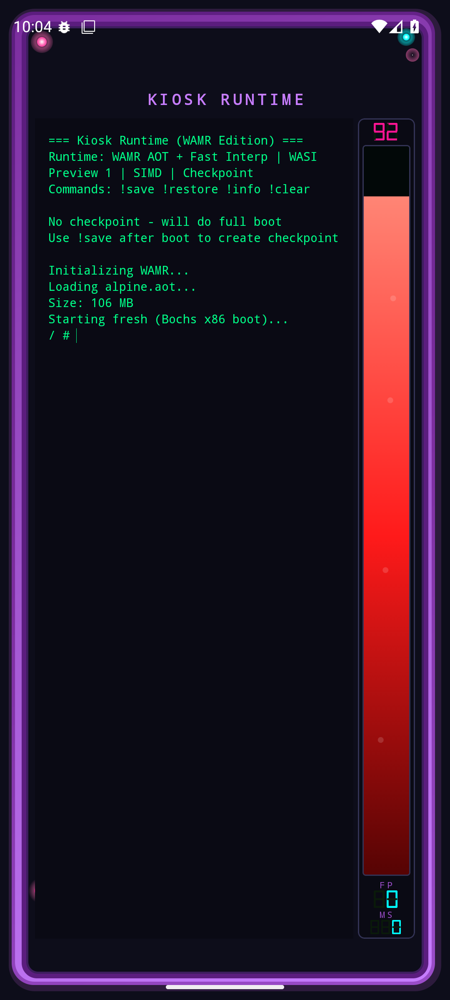
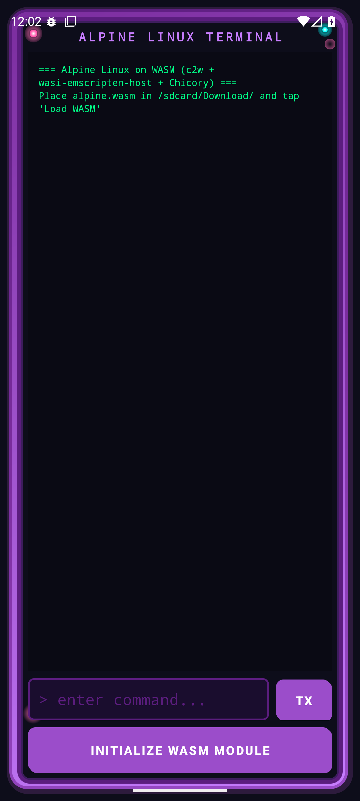

# kotlin-c2w

Run container2wasm (c2w) containers on Android using wasi-emscripten-host + Chicory.



## Features

- **Invader Zim themed UI** - Purple metallic frame with strategic accent lights
- **c2w WASM support** - Boots Alpine Linux in Bochs x86 emulator compiled to WASM
- **Pure Kotlin/Java** - Uses Chicory (pure Java WASM interpreter)

## Key Fixes for c2w Compatibility

c2w WASM binaries require specific WASI configuration:

```kotlin
val host = EmbedderHost {
    fileSystem {
        addPreopenedDirectory("/", "/")  // Required: preopened fd=3
    }
    // CRITICAL: c2w has 1024 byte limit for env vars
    systemEnv = SystemEnvProvider { emptyMap() }
}
```

## Building

1. Build wasi-emscripten-host:
```bash
cd wasi-emscripten-host
./gradlew publishToMavenLocal
```

2. Build Android app:
```bash
cd android-app
./gradlew assembleDebug
```

3. Generate c2w WASM:
```bash
c2w alpine:latest alpine.wasm
```

4. Copy `alpine.wasm` to device internal storage or `/sdcard/Download/`

## Performance

Running Bochs (x86 emulator) inside Chicory (Java WASM interpreter) is very slow.
For production use, consider:
- Native WASM runtimes (wasmer/wasmtime) via JNI
- Chicory AOT compilation mode

## Screenshots

| Initial UI | VM Running |
|------------|------------|
|  |  |

## License

Apache 2.0
